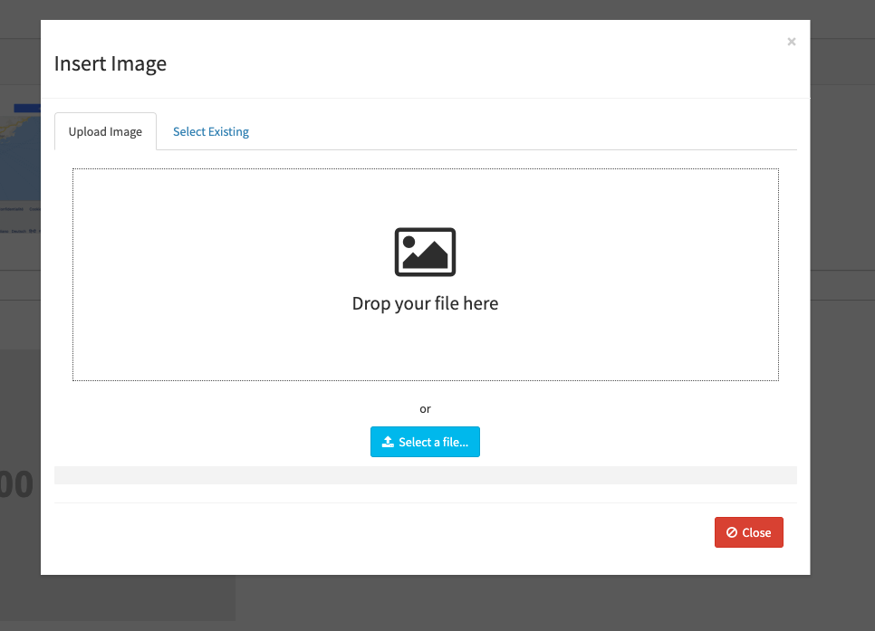
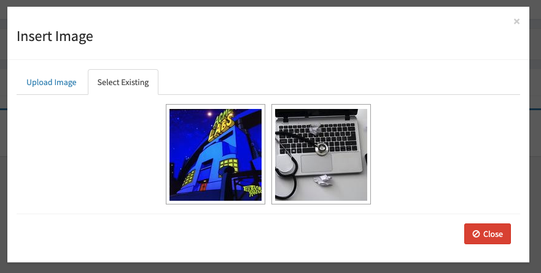
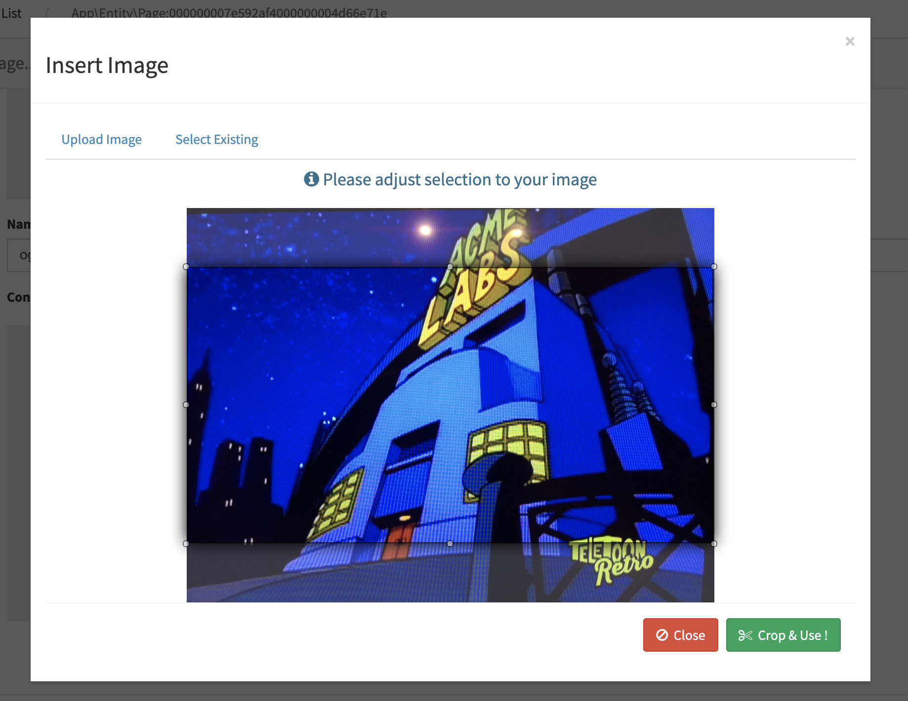
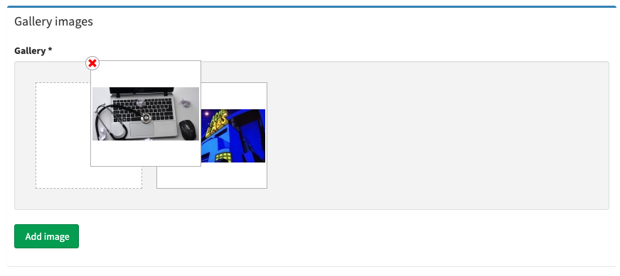

ComurImageBundle
================

## Introduction

Image upload / crop bundle for Symfony2

This bundle helps you easily create an image upload / crop field in your forms. You don't need to use any type of generator or there is no other requirements.
It uses bootstrap to make it look well but you can use any other css to customize it.

It uses beautiful [Jquery File Upload](http://blueimp.github.io/jQuery-File-Upload/) to upload files (original UploadHandler has been modified to add namespace and a new config parameter to generate random filenames) and [JCrop](http://deepliquid.com/content/Jcrop.html) to let you crop uploaded images.

Works perfectly with [ComurContentAdminBundle](https://github.com/comur/ContentAdminBundle). If you don't know what it is, take a look and you will be surprised ! This bundle helps you create beautiful admins with inline editing capabilities with ease !!

If this bundle helps you reduce time to develop, you can pay me a cup of coffee ;)

[](https://www.paypal.com/cgi-bin/webscr?cmd=_s-xclick&hosted_button_id=2RWFAL3ZNTGN6&source=url)

[](https://www.paypal.com/cgi-bin/webscr?cmd=_s-xclick&hosted_button_id=2RWFAL3ZNTGN6&source=url)

## Which version use

|v SF|v Bundle|
|---|---|
|2.x|1.x|
|3.x|2.x|
|4.x|2.x|


:warning: **Use 1.X releases for compatibility with bootstrap 2.x.**

:warning: **Compatibility with bootstrap 2.X is no more maintained**

:warning: **I won't maintain Symfony 2 anymore, I will only merge PR on 1.2 branch for compatibility with SF2. If you need something you can always create a PR and I will merge it.**

:warning: **Animated gif cropping is only available with imagick**

Changelog
---------

Please see on [CHANGELOG.md](CHANGELOG.md)

Screen shots
------------

Here are some screen shots since i didn't have time to put a demo yet:

### Simple Image widget ###


### Gallery widget ###


### Upload image screen ###



### Select image from library screen ###



### Crop image screen ###



### Change gallery image order screen ###



Dependencies
============

Bundle uses following packages in assets (see in bower.json) :

|Package|version|optional|
|---|---|---|
|blueimp-file-upload|^9.31.0|false|
|Jcrop|jcrop#0.9.15|false|
|jquery|^3.4.1|true|
|holderjs|^2.9.6|true|
|bootstrap|^4.3.1|true|
|Font-Awesome|FortAwesome/Font-Awesome#^5.8.2|true|

You can disable auto including of these assets by using modal template inclusion parameters (see step4)

Installation
============

Applications that use Symfony Flex
----------------------------------

### Step 1: Download the Bundle

Open a command console, enter your project directory and execute:

```console
$ composer require comur/content-admin-bundle
```

### Step 2: Enable other bundles

Then, enable the bundle by adding it to the list of registered bundles
in the `config/bundles.php` file of your project:

```php
// config/bundles.php

return [
            // ...
            Comur\ImageBundle\ComurImageBundle::class => ['all' => true],
            FOS\JsRoutingBundle\FOSJsRoutingBundle::class => ['all' => true],
            JMS\TranslationBundle\JMSTranslationBundle::class => ['all' => true],
        ];
```


Applications that don't use Symfony Flex
----------------------------------------

### Step 1: Download the Bundle

Open a command console, enter your project directory and execute the
following command to download the latest stable version of this bundle:

```console
$ composer require comur/content-admin-bundle
```

This command requires you to have Composer installed globally, as explained
in the [installation chapter](https://getcomposer.org/doc/00-intro.md)
of the Composer documentation.

### Step 2: Enable the Bundle and dependency bundles

Then, enable the bundle by adding it to the list of registered bundles
in the `app/AppKernel.php` file of your project:

```php
// app/AppKernel.php

// ...
class AppKernel extends Kernel
{
    public function registerBundles()
    {
        $bundles = [
            // ...
            new Comur\ImageBundle\ComurImageBundle(),
            new FOS\JsRoutingBundle\FOSJsRoutingBundle(),
            new JMS\TranslationBundle\JMSTranslationBundle(),
        ];

        // ...
    }

    // ...
}
```

### Step 3: Add this route to your routing.yml:

```yaml
    # app/config/routing.yml
    fos_js_routing:
      resource: "@FOSJsRoutingBundle/Resources/config/routing/routing.xml"
      
    comur_image:
        resource: "@ComurImageBundle/Resources/config/routing.yml"
        prefix:   /
    ```
 
### Step 4: Add Modal template after body tag of your layout:
  
  ```twig
  <body>
  
  …
  </body>

  ```

**Note:** This template includes many script and styles including jquery and bootstrap. You can use following parameters to avoid jquery and/or bootstrap being included:

```twig

```
  
:warning: **bootstrap_version** is used for bootstrap 4 compatibility issues. If you include bootstrap using bundle, it will use bootstrap 4 and set it to 4 automatically. If you need to use bootstrap 3, remove bootstrap_version parameter or put 3. 
  
### Step 5: Do not forget to put [FOSJSRoutingBundle](https://github.com/FriendsOfSymfony/FOSJsRoutingBundle) script in your <head>:

```html
  <script src="{{ asset('bundles/fosjsrouting/js/router.js') }}"></script>
  <script src="{{ path('fos_js_routing_js', {"callback": "fos.Router.setData"}) }}"></script>
```

:boom: That's it !

Configuration
-------------
**All parameters are optional:**

```yaml
  comur_image:
    config:
      cropped_image_dir: 'cropped'
      thumbs_dir: 'thumbnails'
      media_lib_thumb_size: 150
      public_dir: '%kernel.project_dir%/public/uploads'
      translation_domain: 'ComurImageBundle'
      gallery_thumb_size: 150
      gallery_dir: 'gallery'
```

### cropped_image_dir ###

It's used to determine relative directory name to put cropped images (see above).

**Default value:** 'cropped'

### thumbs_dir ###

It's used to determine relative directory name to put thumbnails (see above).

**Default value:** 'thumbnails'

### media_lib_thumb_size ###

It's used to determine thumbnails size in pixels (squares) used in media library.

**Default value:** 150

### public_dir ###

Path to your public directory. It's used to check thumb existence in thumb twig helper and your upload dir will be relative to this dir (since security fix #80)

**Default value:** '%kernel.project_dir%/public'

### translation_domain ###

Domain name for translations. For instance two languages are provided (en & fr). To override the domain name, change this parameter to whatever you want.

**Default value:** 'ComurImageBundle'

### gallery_thumb_size ###

That's the image size in pixels that you want to show in gallery widget. Gallery widget will automaticaly create square thums having this size and show them in the gallery widget.

**Default value:** 150

### gallery_dir ###

That's the gallery directory name. The widget will store all gallery images in a specific directory inside the root directory that you will give when you will add the widget to your forms.

**For eg.** if you put 'uploads/images' as webDir when you add the widget, gallery images will be stored in 'uploads/images/*[gallery_dir]*'. This is added to make gallery use easier so you don't have to add new functions to your entities to get gallery dirs.

# Usage #


There are two widgets provided with this bundle. They both have exacly same config parameters.

Image widget
------------

Use widget in your forms (works with SonataAdmin too) to create a simple image field :
```PHP
    public function buildForm(FormBuilderInterface $builder, array $options)
    {
      // get your entity related with your form type
      $myEntity = $builder->getForm()->getData();
      ...
      ->add('image', CroppableImageType::class, array(
          'uploadConfig' => array(
              'uploadRoute' => 'comur_api_upload',     //optional
              'uploadDir' => $myEntity->getUploadDir(), // required - see explanation below (you can also put just a dir name relative to your public dir)
              // 'uploadUrl' => $myEntity->getUploadRootDir(),       // DEPRECATED due to security issue !!! Please use uploadDir. required - see explanation below (you can also put just a dir path)
              'webDir' => $myEntity->getUploadDir(),        // required - see explanation below (you can also put just a dir path)
              'fileExt' => '*.jpg;*.gif;*.png;*.jpeg',   //optional
              'maxFileSize' => 50, //optional
              'libraryDir' => null,             //optional
              'libraryRoute' => 'comur_api_image_library', //optional
              'showLibrary' => true,             //optional
              'saveOriginal' => 'originalImage',      //optional
              'generateFilename' => true      //optional
          ),
          'cropConfig' => array(
              'disable' => false,      //optional
              'minWidth' => 588,
              'minHeight' => 300,
              'aspectRatio' => true,         //optional
              'cropRoute' => 'comur_api_crop',   //optional
              'forceResize' => false,       //optional
              'thumbs' => array(           //optional
                array(
                  'maxWidth' => 180,
                  'maxHeight' => 400,
                  'useAsFieldImage' => true  //optional
                )
              )
          )
      ))
```
You need to create a field (named image in this example but you can choose whatever you want):

```PHP
  // YourBundle\Entity\YourEntity.php
  
  ...
  
    /**
     * @ORM\Column(type="string", length=255, nullable=true)
     */
    protected $image;
    
    ...
```

And create your functions in your entity to have directory paths, for ex :

```PHP
  /* DEPRECATED, Use upload dir
  public function getUploadRootDir()
  {
      // absolute path to your directory where images must be saved
      return __DIR__.'/../../../../../web/'.$this->getUploadDir();
  }*/
  
  /* Directory relative to your public dir (see public_dir in configuration)
  public function getUploadDir()
  {
      return 'uploads/myentity';
  }
  
  public function getWebPath()
  {
      return null === $this->image ? null : '/'.$this->getUploadDir().'/'.$this->image;
  }
```
    
That's all ! This will add an image preview with an edit button in your form and will let you upload / select from library and crop images without reloading the page.

To save original image path, you have to create another field and name it same as saveOriginal parameter:

```PHP
  // YourBundle\Entity\YourEntity.php
  
  …
  
  /**
     * @ORM\Column(type="string", length=255, nullable=true)
     */
    protected $originalImage;
    
    …
```


I will put a demo soon…

Gallery widget
------------

Use widget in your forms (works with SonataAdmin too) to create a **sortable** list of images (so a gallery :)) stored in an array typed field :

```PHP
  ->add('gallery', CroppableGalleryType::class, array(
    //same parameters as comur_image
  ))
```
  
And create your array typed field for storing images in it. Doctrine (or other ORM) will serialize this field to store it as string in the DB.

```PHP
  // YourBundle\Entity\YourEntity.php
  
  ...
  
    /**
     * @ORM\Column(type="array", nullable=true)
     */
    protected $gallery;
    
    ...
    
```
And create your functions in your entity to have directory paths, for ex :

```PHP
    /* DEPRECATED, Use upload dir
    public function getUploadRootDir()
    {
        // absolute path to your directory where images must be saved
        return __DIR__.'/../../../../../web/'.$this->getUploadDir();
    }*/

    public function getUploadDir()
    {
        return 'uploads/myentity';
    }

    public function getWebPath()
    {
        return null === $this->image ? null : '/'.$this->getUploadDir().'/'.$this->image;
    }
```

That's all ! This will create a widget like on the following image when you will use it in your forms. **You can also reorder them since php serialized arrays are ordered**:

Gallery images will be stored in uploadDir / gallery_dir (default is gallery). Cropped images will be stored in uploadDir / gallery_dir / cropped_dir (same as image widget) and thumbs in uploadDir / gallery_dir / cropped_dir / thumb_dir with specified width. So if you pu

## uploadConfig ##

### uploadRoute (optional) ###

Route called to send uploaded file. It's recommended to not change this parameter except if you know exactly what you do.

**Default value:** comur_api_upload

### uploadDir (required) ###

**Since 2.0.3**

**Replaces uploadUrl removed because a security issue (see #80)**

Public dir relative path to directory where put uploaded image. I recommend you to create a function in your entity and call it like it's shown in the example:

```PHP
    /* DEPRECATED, Use upload dir
    public function getUploadRootDir()
    {
        // absolute path to your directory where images must be saved
        return __DIR__.'/../../../../../web/'.$this->getUploadDir();
    }*/

    public function getUploadDir()
    {
        return 'uploads/myentity';
    }

    public function getWebPath()
    {
        return null === $this->image ? null : '/'.$this->getUploadDir().'/'.$this->image;
    }
```

### webDir (required) ###

Url used to show your image in templates, must be relative url. If you created related functions as explained in uploadDir section, then you can user getWebPath() function for webDir parameter.

### fileExt (optional) ###

Permitted image extensions.

**Default value:** '*.jpg;*.gif;*.png;*.jpeg'

### maxFileSize (optional) ###

Permitted maximum image weight in MB.

**Default value:** 50 (50Mb)

### libraryDir (optional) ###

Directory to look into for images to show in image library.

**Default value:** uploadDir

### libraryRoute (optional) ###

Route called to get images to show in library. I recommend you to not change this parameter if you don't know exactly what it does.

**Default value:** comur_api_image_library

### showLibrary (optional) ###

Set this to false if you don't want the user see existing images in libraryDir.

**Default value:** true

### saveOriginal (optional) ###

Use this parameter if you want to save original file's path (for eg. to show big image in a lightbox). You have to put property name of your entity and the bundle will use it to save original file path in it.

**Attention:** This parameter is disabled for gallery for instance. It will be implemented soon.

**Default value:** false

### generateFilename (optional) ###

This parameter is used to generate an uniq file name. Setted to false, it will keep the original filename.

**Default value:** true

## cropConfig ##

### disable (optional) ###

**Since 2.0.4**

Disables cropping feature and saves directly original image

**Default value:** false

### minWidth (optional) ###

Minimum with of desired image.

**Default value:** 1

### minHeight (optional) ###

Minimum height of desired image.

**Default value:** 1
### aspectRatio (optional) ###

True to aspect ratio of crop screen.

**Default value:** true

### cropRoute (optional) ###

Route to crop action. I recommend you to not change this parameter if you don't know exactly what it does.

**Default value:** comur_api_crop


### forceResize (optional) ###

If true, system will resize image to fit minWidth and minHeight.
**Default value:** false

### thumbs (optional) ###

Array of thums to create automaticly. System will resize images to fit maxWidth and maxHeight. It will put them in "uploadDir/cropped_images_dir/thumbs_dir/widthxheight-originalfilename.extension" so you can use included Thumb Twig extension to get them, ex:

```twig
{# your_themplate.html.twig #}
<img src="{{ entity.imagePath|thumb(45, 56) }}"
      
```

**New in 0.2.2:** You can use 'useAsFieldImage' option to use this thumb as image field's preview (in your form you will see this thumb instead of original cropped image). Usefull when you have big cropped images.

SECURITY
========

Please read following documentation about upload best practices: https://github.com/blueimp/jQuery-File-Upload/blob/master/SECURITY.md

# TODO LIST #

* Create tests
* Add more comments in the code
* Think about removed image deletion (for now images are not deleted, you have to care about it by yourself…)
* Update existing images list dynamicly after an image upload
* Add javascript events (in progress) 


